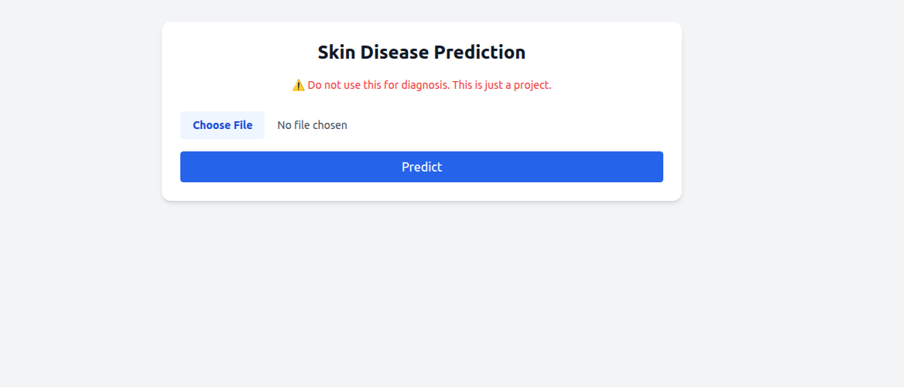
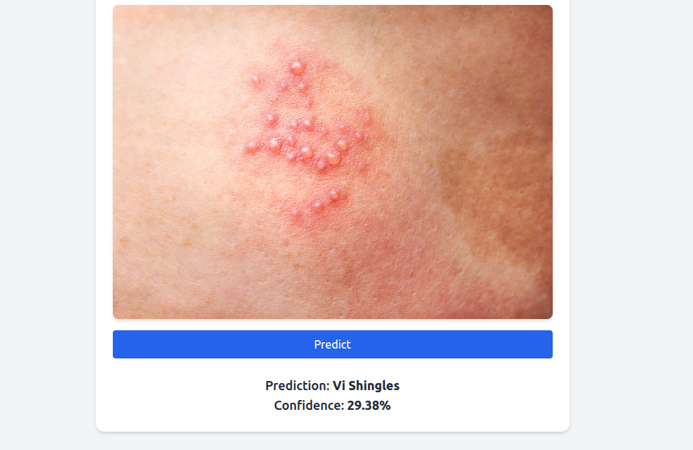

# 🧪 Skin Disease Detection Web App

This is a web application that allows users to upload an image of a skin condition and get a predicted diagnosis using a deep learning model. The app was built for educational purposes and is **not intended for medical diagnosis**.

## 🚀 Features

- Upload skin condition images directly in the browser
- Get predictions using a pre-trained `MobileNetV2` model
- Simple and responsive UI
- Built with **FastAPI** and **HTML/CSS**
- Deployed on [Render](https://render.com)

---

## ⚠️ Disclaimer

> **This tool is only a project and should not be used for medical diagnosis or treatment decisions. Always consult a healthcare professional.**

---

## 🖼️ How to Use

1. Go to the deployed URL (e.g., `https://skin-disease-detection-1-afzb.onrender.com/`)
   
2. Click the "Choose File" button to upload an image
3. Click "Upload"
4. View the image and the predicted skin disease class below
   

---

## 🧠 Model Info

- Trained on a labeled dataset of skin diseases using MobileNetV2
- Format: `.h5` Keras model
- Loaded using TensorFlow in the backend

---

## 🛠️ Tech Stack

- **Backend**: FastAPI
- **Frontend**: HTML + CSS + JavaScript
- **Model**: TensorFlow / Keras `.h5` model
- **Deployment**: Render

